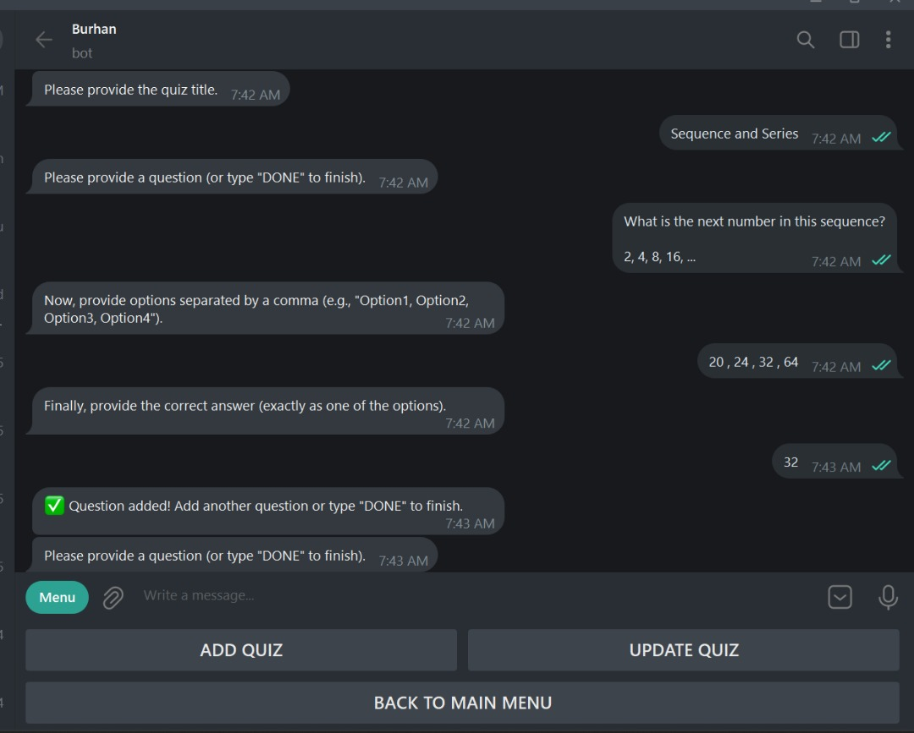
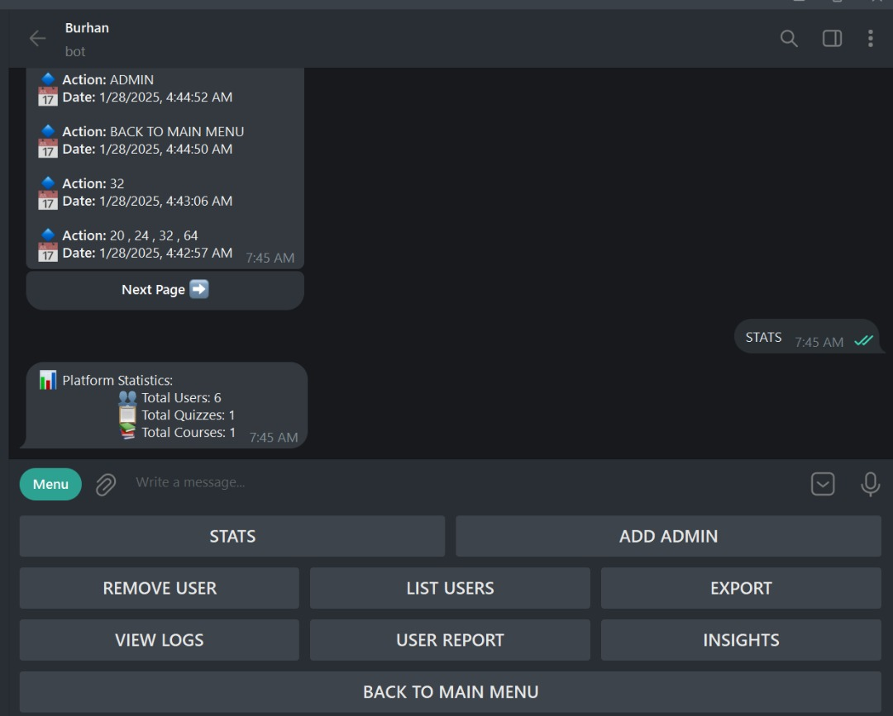
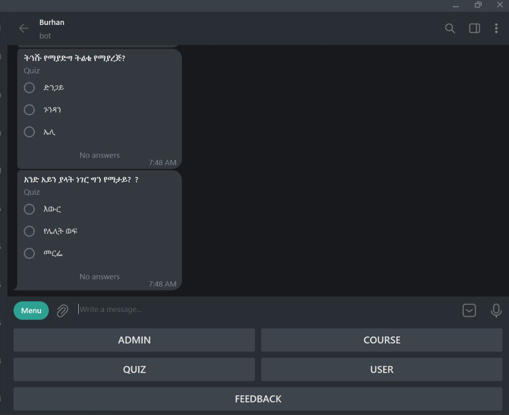

# 🌟 Burhan Academy 🌟  
🚀 *Empowering Education Through Technology*  

  
*A powerful Telegram bot tailored for schools, combining efficiency and interactivity for grades 1-8.*  

---

## 📚 Key Features  

### 👩‍🏫 Teacher Capabilities  
- ✏️ Create and manage **courses** effortlessly.  
- 🎯 Design engaging **quizzes** with multiple-choice questions.  
- 📂 Generate **PDF quizzes** for offline use.  

#### Example: Course Creation and Quiz Management  
  

---

### 🔑 Admin Capabilities  
- 📊 Gain actionable **insights** into user activity.  
- 👀 Monitor **specific user engagement**.  
- 🛠️ **Promote or demote admins**, and remove users.  
- 🌐 Full control over platform **settings** and user management.  

#### Example: Admin Dashboard  
  

---

### 👨‍🎓 Student Capabilities  
- 📝 Take quizzes and **track progress** over time.  
- 📥 Request **PDF versions** of quizzes for offline study.  
- 🔄 Practice quizzes for **self-assessment** and improvement.  
- 🏆 Unlock achievements with **real-time progress tracking**.  

#### Example: Student Progress Tracking  
  

---

<!-- ## 🎥 Sneak Peek  

  
> *Interactive and intuitive learning experience for teachers, students, and admins!*   -->

---

## 🚀 Getting Started  

### Prerequisites  
- **Node.js** (v20 or later)  
- **MongoDB 

### Installation  

1. **Clone the repository**:  
   ```bash
   git clone https://github.com/Abe-Garage/burhan.git
   cd burhan
